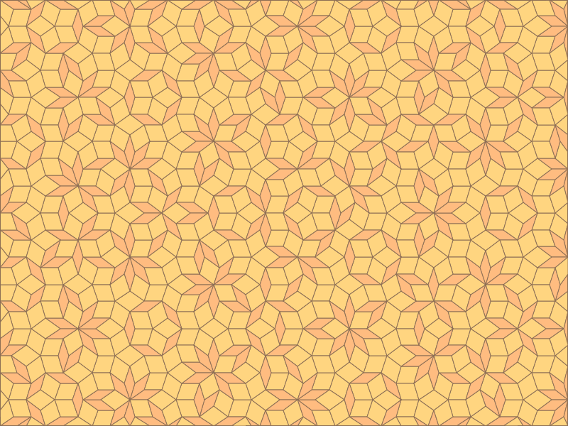
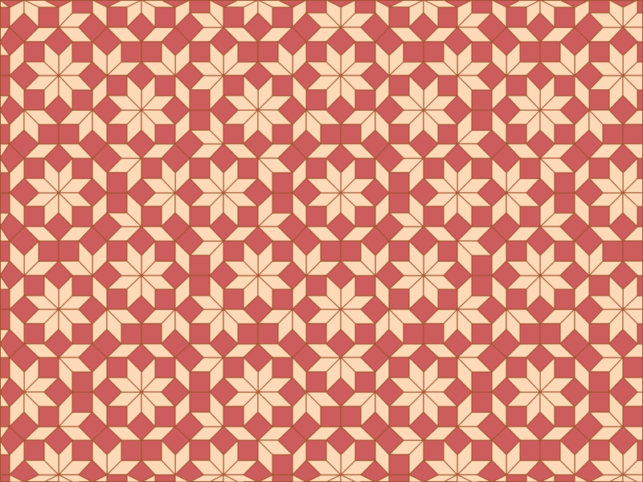
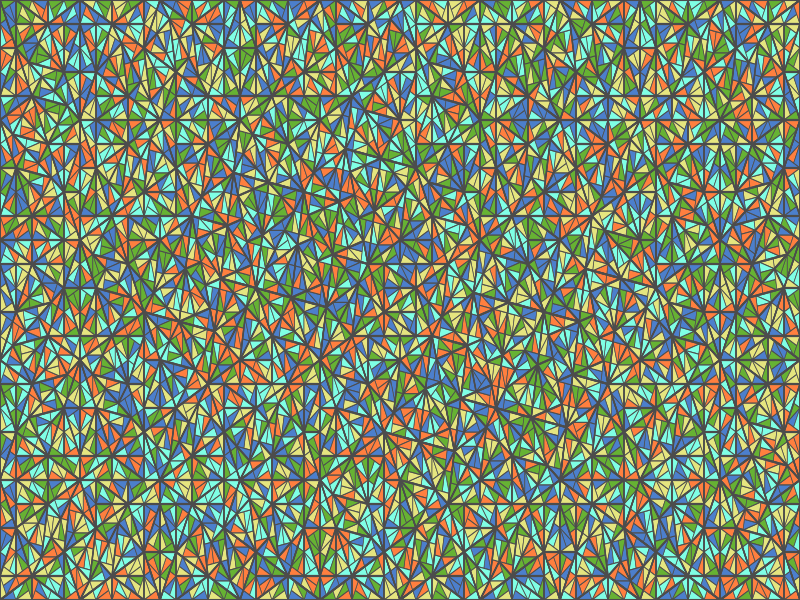

# Tiling Gallery

**Tiling Gallery** is a Rust-based CLI tool for generating SVG images of two types of aperiodic tilings:

- **Penrose tiling** using the De Bruijn pentagrid method
- **Pinwheel tiling** with recursive triangle subdivision

This project is ideal for generating mathematical and artistic patterns based on non-periodic tilings.

---

## ✨ Features

- Generate **Penrose tilings** using customizable pentagrid settings.
- Create **Pinwheel tilings** with a specified number of recursive iterations.
- Output in **SVG format** with configurable size and color.
- Fast and lightweight CLI tool written in Rust.

---

## 🛠 Installation

Make sure you have [Rust](https://www.rust-lang.org/tools/install) installed.

Then clone and build:

```bash
git clone https://github.com/your_username/tiling-gallery.git
cd tiling-gallery
cargo build --release
```
The binary will be available at target/release/tiling-gallery.

## 🚀 Usage
Run the CLI with one of the available subcommands:
### 🌀 Generate Penrose Tiling
```
./tiling-gallery debruijn \
--dimension 5 \
--num-lines 12 \
--width 800 \
--height 600 \
--fat-color "#FF9F1C" \
--thin-color "#2EC4B6" \
--edge-color "#6D6875" \
--output-filename "penrose.svg"
```
**Options**

| Flag                | Description                        | Default      |
| ------------------- | ---------------------------------- | ------------ |
| `--dimension`       | Number of pentagrid directions     | `5`          |
| `--num-lines`       | Number of lines per direction      | `12`         |
| `--width`           | SVG canvas width                   | `800`        |
| `--height`          | SVG canvas height                  | `600`        |
| `--fat-color`       | Color of fat rhombuses (hex code)  | `#FF9F1C`    |
| `--thin-color`      | Color of thin rhombuses (hex code) | `#2EC4B6`    |
| `--edge-color`      | Color of tile edges (hex code)     | `#6D6875`    |
| `--output-filename` | Output SVG file name               | `output.svg` |

**example**


If you set dimension to 4, you can get Ammann Beenker Tiling.


### 🧩 Generate Pinwheel Tiling
```
./tiling-gallery pinwheel \
    --iterations 5 \
    --width 800 \
    --height 600 \
    --output-filename "pinwheel.svg"

```
**Options**

| Flag                | Description                 | Default      |
| ------------------- | --------------------------- | ------------ |
| `--iterations`      | Recursive subdivision depth | `5`          |
| `--width`           | SVG canvas width            | `800`        |
| `--height`          | SVG canvas height           | `600`        |
| `--output-filename` | Output SVG file name        | `output.svg` |

**example**


## 📁 Output
Both subcommands will generate an SVG file with the specified name in the current directory.

## 🧠 Background
- Penrose Tiling is an aperiodic tiling discovered by Roger Penrose. This implementation uses the De Bruijn pentagrid method to construct it.

- Pinwheel Tiling is a non-periodic tiling where a right triangle is recursively subdivided and rotated.

